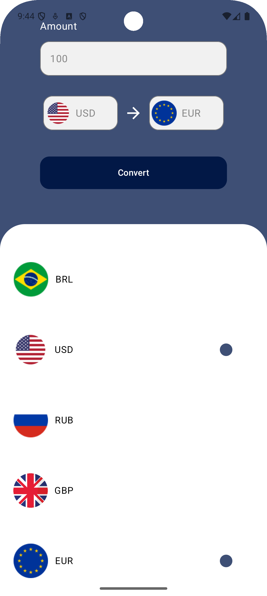
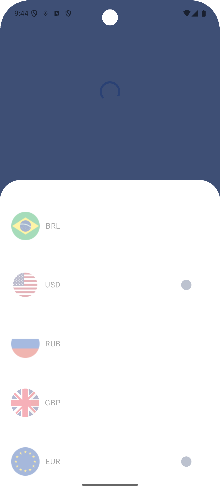
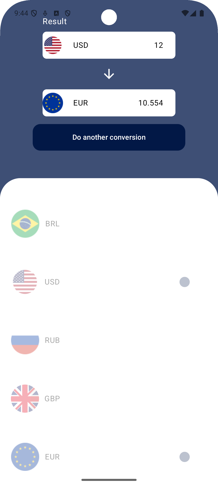

# ConverterApp

**ConverterApp** makes it easy to convert currencies quickly and accurately. With a clean and user-friendly interface, the app lets you choose your currencies, enter an amount, and see real-time results powered by AwesomeAPI. Ideal for travel, online shopping, or tracking exchange rates with ease.
## Features

- **WelcomeScreen:**  
  A welcoming introduction screen that sets the stage for a seamless conversion experience.

- **ConverterScreen:**  
  Convert between a wide array of currencies instantly. Enter an amount, choose your source and target currencies, and get real-time conversion results with each keystroke.

- **Real-Time Exchange Rates:**  
  Powered by the [AwesomeAPI](https://docs.awesomeapi.com.br) for always up-to-date conversion rates.

## Screenshots

| Welcome Screen | Converter Screen | Loading Screen | Result Screen |
|-----------|---------------|---------------|---------------|
|  |  |   |  |


## 🛠️ Technologies Used

- **Jetpack Compose:** Used to build a modern, reactive, and declarative UI.
- **MVVM Architecture:** Ensures a clean separation of concerns with scalable and maintainable code.
- **Retrofit + Gson:** Communicates with the AwesomeAPI and handles JSON parsing automatically.
- **Kotlin:** Primary language for concise and efficient Android development.
- **Custom Animations:** Smooth transitions that enhance the user experience.

## Getting Started

To run ConverterApp locally:

1. **Clone the repository:**

```bash    
bash
git clone https://github.com/AllanAviana/ConverterApp-Android.git
```


2. **Open the project in Android Studio.**

3. **Build and run** on your emulator or physical device.
